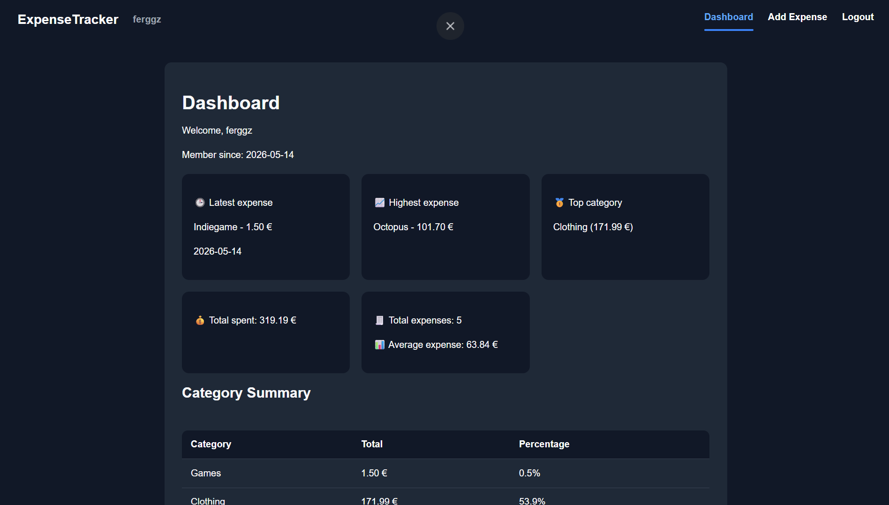
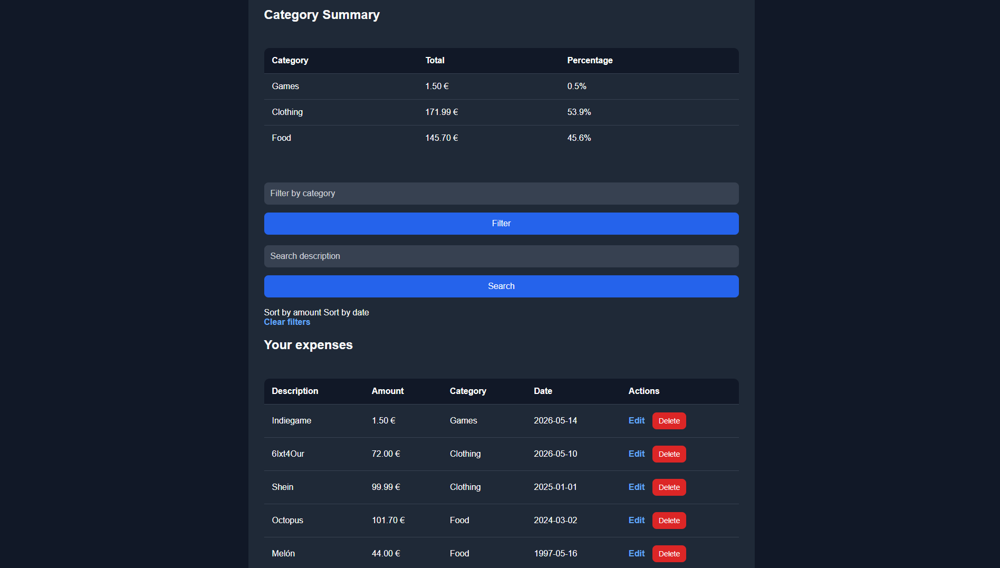
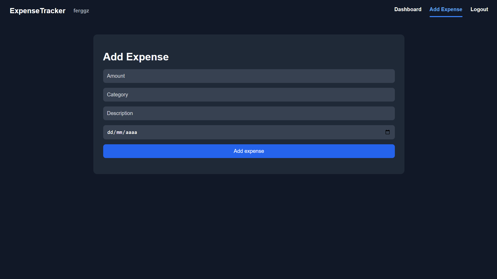
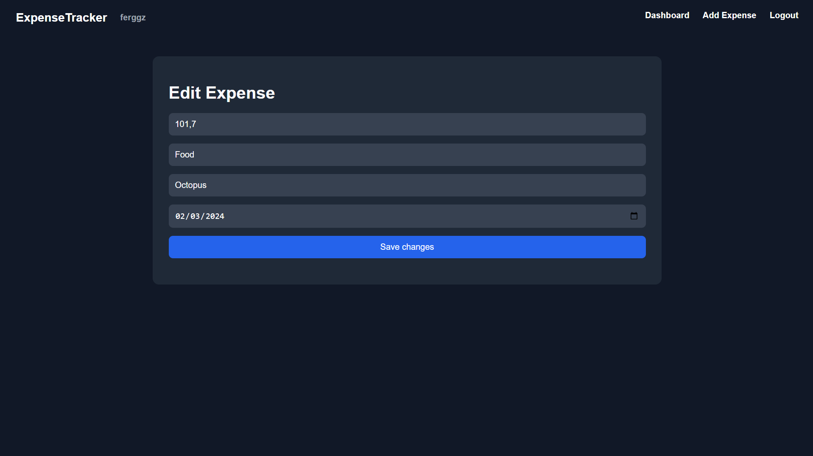
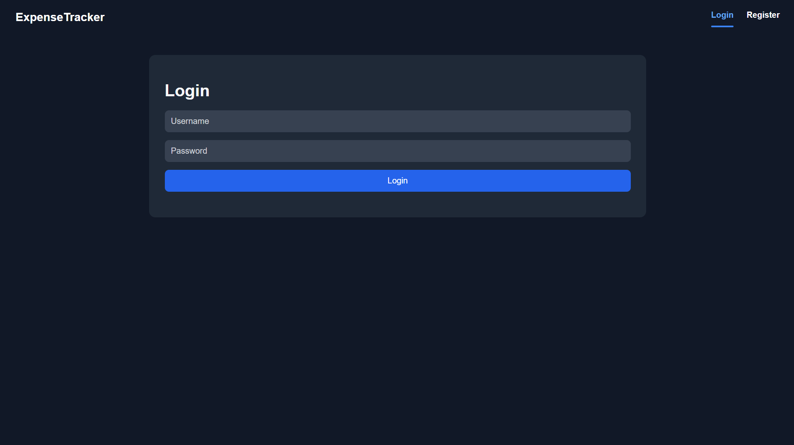
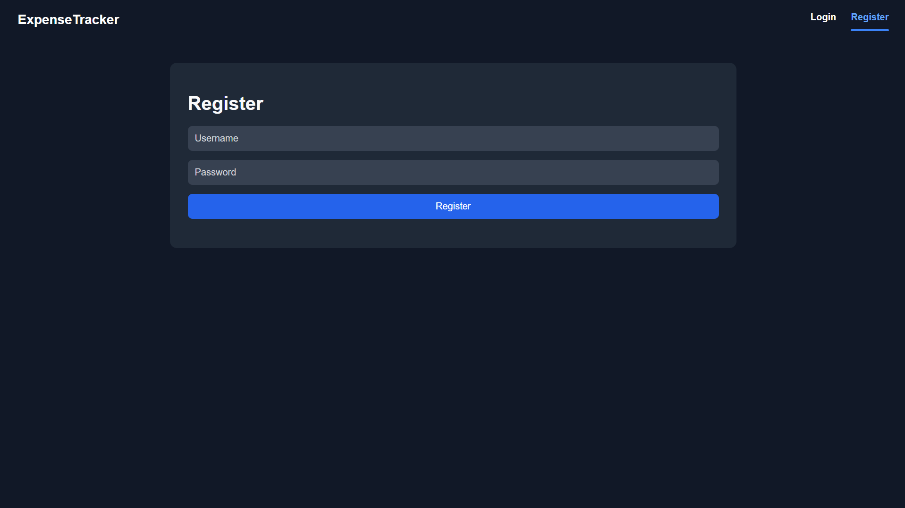

# Expense Tracker Web

A Flask web application to track personal expenses with user authentication, SQLite storage and dashboard analytics.

## What I Learned

Through this project I practiced:

- Building a Flask application with multiple modules
- Using SQLite for persistent data storage
- Creating user authentication with hashed passwords
- Managing sessions and protected routes
- Building CRUD functionality
- Writing SQL queries with filters and search
- Structuring reusable helper functions
- Using templates with Jinja inheritance
- Managing environment variables
- Improving UI with CSS

## Features

- User registration and login
- Password hashing
- Session-based authentication
- Add, edit and delete expenses
- Filter expenses by category
- Search expenses by description
- Sort expenses by amount or date
- Dashboard statistics
- Category summaries and percentages
- SQLite database
- Responsive layout

## Technologies Used

- Python
- Flask
- SQLite
- HTML
- CSS
- Jinja
- python-dotenv

## How to Run

Create and activate a virtual environment:

```bash
python -m venv .venv
source .venv/Scripts/activate
```

Install dependencies:

```bash
pip install -r requirements.txt
```

Create a `.env` file:

```env
SECRET_KEY=your-secret-key
```

Initialize the database:

```bash
python init_db.py
```

Run the app:

```bash
python app.py
```

Then open:

```text
http://127.0.0.1:5000
```

## Future Improvements

- Deploy the app online
- Add PostgreSQL support
- Add monthly reports
- Add charts
- Add password reset
- Improve mobile UI

## Screenshots

### Dashboard




### Add Expense



### Edit Expense



### Login



### Register

